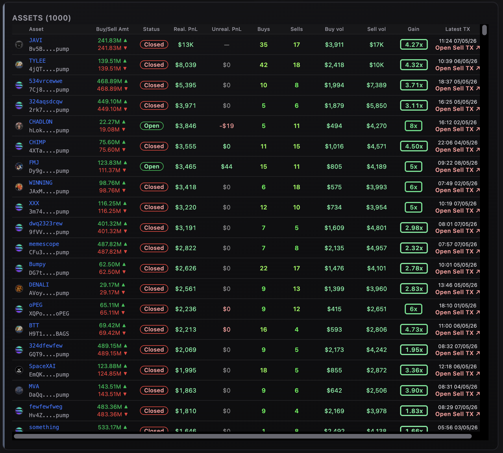
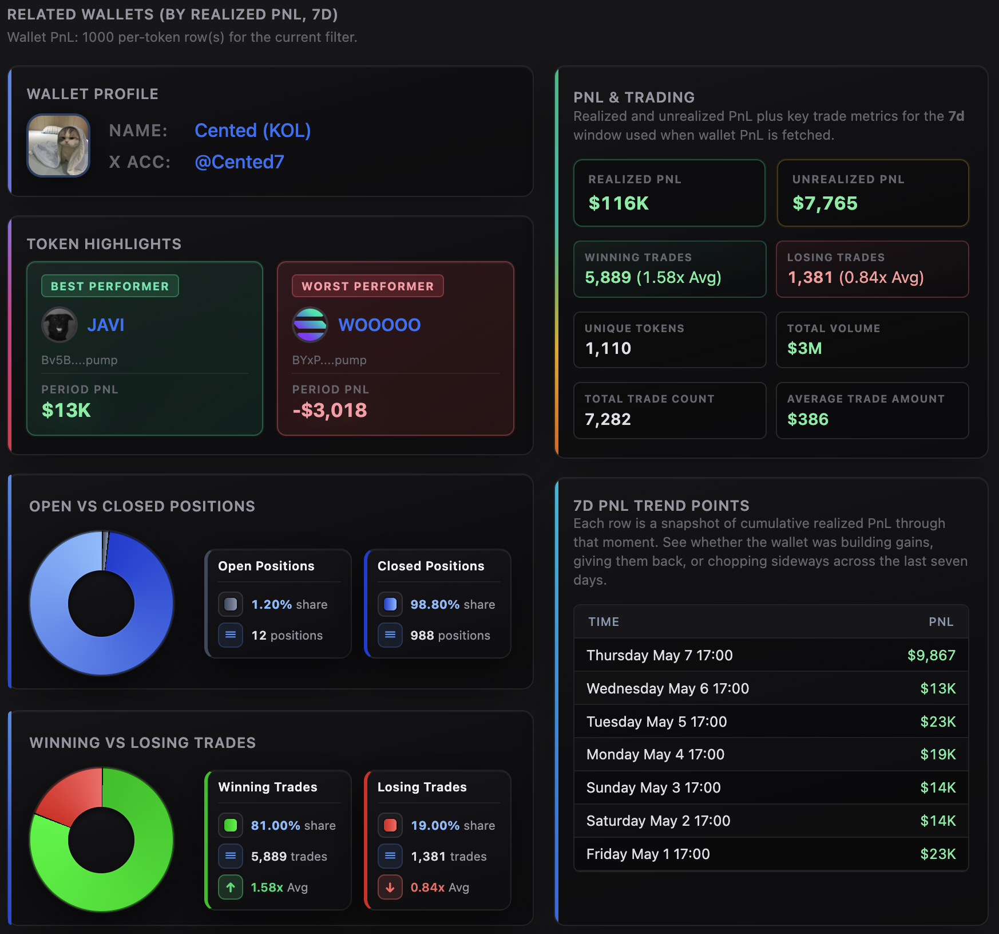

# Solana Wallet PnL Profit & Loss API

This repository demonstrates how to use the Vybe Solana wallet APIs to fetch, explore, and present **per-wallet profit and loss (PnL)** together with **related wallets** ranked by realized PnL for the same resolution window. It includes a production-ready Node.js backend and a browser UI that integrate Vybe’s wallet PnL, top-traders (related wallets), trades, program labels, and token metadata—so you can search by wallet address or partial name (`ilikeFilter`), load wallet-scoped PnL rows, and browse the related-wallets leaderboard with the same query parameters you would send to Vybe.

Try the live demo: https://solana-wallet-pnl-profit-and-loss-api.vybenetwork.com

Use this project as a reference implementation or starter kit for building Solana wallet analytics, leaderboards, and PnL dashboards powered by Vybe’s wallet and market data.



<p align="center">
  
</p>

---

**[Try the LIVE demo →](https://solana-wallet-pnl-profit-and-loss-api.vybenetwork.com)**

**[Get your free Vybe API key →](https://vybenetwork.com/pricing)**

**[Vybe quick start →](https://docs.vybenetwork.com/docs/quick-start)**

---

## Prerequisites

- **Node.js** ≥ 20 (LTS recommended)
- **npm** ≥ 10 (or equivalent)

## Quick Start

Get from clone to running app in a few commands:

```bash
git clone https://github.com/vybenetwork/solana-wallet-pnl-profit-and-loss-api.git
cd solana-wallet-pnl-profit-and-loss-api
npm install
cp .env.example .env
# Edit .env and set VYBE_API_KEY=your_api_key_here
npm start
```

Then open **http://localhost:3000**, enter a **wallet address or name** (mapped to Vybe `ilikeFilter` when not a full address), tune **resolution** and sort controls if needed, and click **Load wallet PnL** to fetch wallet PnL and related wallets.

## Environment Variables

| Variable          | Required | Description                                                                 | Example                                   |
|-------------------|----------|-----------------------------------------------------------------------------|-------------------------------------------|
| `VYBE_API_KEY`    | Yes      | Vybe API key used for all Vybe requests                                     | `your_api_key_here`                       |
| `SOLANA_RPC_URL`  | No       | RPC endpoint for Metaplex symbol lookup (token-symbol fallback)             | `https://api.mainnet-beta.solana.com`     |
| `PORT`            | No       | HTTP server port                                                            | `3000`                                    |
| `TUNNEL`          | No       | Set to `1` to run behind a Cloudflare Tunnel                                | `1`                                       |
| `TRADES_LOG`      | No       | Set to `1` to append `/api/trades` request lines to `trades-requests.log`   | `0`                                       |

Get your API key at `https://vybenetwork.com/pricing`.

---

## What This Repo Provides

- **Wallet PnL and related-wallets proxy**
  - Express server that proxies Vybe:
    - `GET /v4/wallets/{ownerAddress}/pnl` (per-wallet token-level PnL for a resolution window)
    - `GET /v4/wallets/top-traders` (related wallets / leaderboard for `mintAddress` or `ilikeFilter`)
    - `GET /v4/tokens/{mintAddress}/top-pnl-traders` (token-scoped top PnL traders; used when the UI is in token-oriented flows)
    - `GET /v4/trades` (supporting trade context where the UI requests it)
    - `GET /v4/programs/labeled-program-accounts` (program labels)
    - `GET /v4/tokens/{mintAddress}` (token metadata for optional token panels)
- **Wallet PnL web UI**
  - Single-page GUI (no frameworks) built from `src/frontend/app.ts` into `public/app.js` (`npm start` runs `prestart` → `npm run build:frontend`).
  - **Realtime** flow: wallet search, resolution (1d / 7d / 30d), optional `mintAddress` filter on PnL, sort field and direction, pagination, and a **Related wallets** grid driven by top-traders.
- **Remote filters (Vybe query params)**
  - Controls at the top and second row map directly to Vybe query params (`ilikeFilter`, `resolution`, `label`, `sortByAsc` / `sortByDesc`, `limit`, `page`, optional `mintAddress` on wallet PnL).
- **Retries and errors**
  - Shared HTTP client (`src/api/client.ts`) with timeouts, retries, and human-readable error messages for failed Vybe calls.

---

### Solana API docs for these endpoints

- **Related wallets / top traders (`GET /v4/wallets/top-traders`)**:
  - [https://docs.vybenetwork.com/reference/get_top_traders_v4](https://docs.vybenetwork.com/reference/get_top_traders_v4)
- **Wallet PnL (`GET /v4/wallets/{ownerAddress}/pnl`)**:
  - [https://docs.vybenetwork.com/reference](https://docs.vybenetwork.com/reference) (wallet PnL lives alongside wallet endpoints in the Vybe reference)
- **Trade data (`GET /v4/trades`)**:
  - [https://docs.vybenetwork.com/reference/get_trade_data_program_v4](https://docs.vybenetwork.com/reference/get_trade_data_program_v4)
- **Token details (`GET /v4/tokens/{mintAddress}`)**:
  - [https://docs.vybenetwork.com/reference/get_token_details_v4](https://docs.vybenetwork.com/reference/get_token_details_v4)
- **Token top PnL traders (`GET /v4/tokens/{mintAddress}/top-pnl-traders`)**:
  - [https://docs.vybenetwork.com/reference](https://docs.vybenetwork.com/reference)
- **Labeled programs (`GET /v4/programs/labeled-program-accounts`)**:
  - [https://docs.vybenetwork.com/reference/get_known_program_accounts_v4](https://docs.vybenetwork.com/reference/get_known_program_accounts_v4)

---

## Why Wallet PnL & Related Wallets Matter

Wallet-level PnL and related-wallet discovery are useful for:

- **Trader intelligence**: see realized and unrealized PnL, trade counts, and win rate for a wallet over a chosen window.
- **Network effects**: surface wallets with similar behavior or peer performance via **top traders** for the same filter and resolution.
- **Product UX**: ship a credible wallet dashboard without operating your own indexer—Vybe aggregates trades and PnL across Solana venues.

This repo shows how to wire a **practical wallet explorer** on top of Vybe’s wallet PnL and top-traders endpoints.

---

## Frontend Overview (Wallet PnL UI)

The wallet UI is implemented in `src/frontend/app.ts` and compiled to `public/app.js` via `npm run build:frontend` (also run automatically before `npm start`).

### Sections

- **Remote filters (wallet + endpoint row)**
  - **Endpoint mode**: Realtime vs Historical switch (Historical is disabled in the current UI until the timeseries section ships).
  - **Wallet address or name** (`ilikeFilter` / owner resolution), **Resolution** (1d, 7d, 30d), **Wallet PnL sort** and related controls that map to Vybe query params.


- **Wallet PnL summary and token rows**
  - After **Load wallet PnL**, the UI renders wallet PnL metadata, per-token metrics (where returned), charts/cards depending on payload, and links or copy-friendly addresses.

- **Related wallets (top traders)**
  - Grid of wallets returned by `GET /v4/wallets/top-traders` for the same scope, sorted by realized PnL for the selected resolution.


- **Second-row controls (pagination and filters)**
  - **Wallet traders label** (`label`), optional **Wallet PnL mint** (`mintAddress`), **Sort direction**, **limit**, **page**, and loading indicator beside **Load wallet PnL**.

- **Token stats & token-mode panels** (when enabled in the build)
  - Optional sections for token metadata, supply charts, and token top PnL traders—wired to the same proxy routes when those panels are visible.

---

## Filters & Workflow

### Remote filters (Vybe query params)


The top of the UI controls the requests sent to the API:

- **Wallet search** — full address or partial name; forwarded as `mintAddress` or `ilikeFilter` per Vybe rules for top-traders and as the owner for wallet PnL.
- **Resolution** — `1d`, `7d`, or `30d` for both wallet PnL and related wallets where applicable.
- **Wallet PnL sort** — `sortByDesc` / `sortByAsc` field for per-wallet token rows (e.g. `realizedPnlUsd`).
- **Label** — `label=all|kol` style filter for top-traders when exposed in the UI.
- **limit / page** — pagination for wallet PnL and related wallet queries.

These map to the proxy routes in `src/server.ts` and are forwarded to Vybe with your `VYBE_API_KEY`.

### Second-row wallet controls


After the primary row, optional controls refine the same Vybe calls:

- **Wallet traders label** — forwarded as `label` on top-traders when Vybe expects it (UI omits invalid combinations such as `label=all` where the API rejects it).
- **Wallet PnL mint** — optional `mintAddress` filter on `GET /v4/wallets/{owner}/pnl`.
- **Sort direction, limit, page** — standard pagination and sort order for wallet PnL and related lists.

Changing these and clicking **Load wallet PnL** refetches from the proxy.

---

## Historical mode (UI roadmap)

The UI may show a **Historical** path for wallet PnL **timeseries** in the future. In the current repository, **Historical is disabled in the browser** while that section is implemented; the Express server focuses on **realtime** wallet PnL (`GET /v4/wallets/{ownerAddress}/pnl`) and **related wallets** (`GET /v4/wallets/top-traders`). When Historical ships, this README will document the matching proxy route (for example `GET /api/wallets/:owner/pnl-ts` → Vybe `pnl-ts`) alongside the UI.

---

## Server Proxy Routes

The Express server in `src/server.ts` exposes:

- **`GET /api/wallets/top-traders`**
  - Proxies to Vybe `GET /v4/wallets/top-traders` with query params: `mintAddress` or `ilikeFilter`, `resolution`, `label`, `sortByAsc` / `sortByDesc`, `limit`, `page`.
- **`GET /api/wallets/:ownerAddress/pnl`**
  - Proxies to Vybe `GET /v4/wallets/{ownerAddress}/pnl` with `resolution`, optional `mintAddress`, sort fields, `limit`, `page`.
- **`GET /api/tokens/:mint/top-pnl-traders`**
  - Proxies to Vybe `GET /v4/tokens/{mintAddress}/top-pnl-traders` with resolution and sort pagination.
- **`GET /api/tokens/:mint`**
  - Proxies to Vybe `GET /v4/tokens/{mintAddress}` for token metadata.
- **`GET /api/tokens/:mint/top-holders`**
  - Proxies to Vybe top holders for the mint (optional UI).
- **`GET /api/trades`**
  - Proxies to Vybe `GET /v4/trades` with `mintAddress`, `limit`, `page`, `sortByDesc`, optional `timeStart` / `timeEnd`.
- **`GET /api/programs/labeled-program-account?programAddress=…`**
  - Proxies to Vybe labeled program lookup; responses cached on disk (`data/`).
- **`POST /api/programs/labeled-program-accounts`**
  - Batch labeled programs; merges with on-disk cache.
- **`GET /api/token-symbol/:mint`** and **`POST /api/token-symbols`**
  - Symbol resolution (Metaplex / Vybe fallback); cached under `data/`.

All Vybe requests use a shared client (`src/api/index.ts`) with timeouts, retries, and `toHumanReadableError`. Symbol and program-label caches are JSON files in the **`data/`** directory (created on demand).

---

## How to Run

### 1. Clone the repository

```bash
git clone https://github.com/vybenetwork/solana-wallet-pnl-profit-and-loss-api.git
cd solana-wallet-pnl-profit-and-loss-api
```

### 2. Install dependencies

```bash
npm install
```

### 3. Set your API key

```bash
cp .env.example .env
# Add your VYBE_API_KEY to .env
```

### 4. Run the server + web app

```bash
npm start
```

Then open **http://localhost:3000**. The UI loads **wallet PnL** and **related wallets** for the search and resolution you choose; use **Load wallet PnL** after changing remote filters.

### 5. (Optional) Run with Cloudflare Tunnel

To expose the app on a public URL (e.g. for sharing or testing from another device), enable a tunnel (requires `cloudflared` installed):

```bash
TUNNEL=1 npm start
```

Or use the npm script:

```bash
npm run dev:tunnel
```

The console will print a **Cloudflare Tunnel URL** when `cloudflared` starts successfully.

---

## Project Structure

```text
solana-wallet-pnl-profit-and-loss-api/
├── .env.example           # Copy to .env, fill in VYBE_API_KEY (and optional SOLANA_RPC_URL, PORT, TUNNEL, TRADES_LOG)
├── tsconfig.json          # TypeScript config for backend (tsx runs src/server.ts)
├── tsconfig.frontend.json # TypeScript config for frontend (builds public/app.js)
├── package.json           # Scripts and pinned dependencies
├── README.md
├── screenshots/           # Screenshots referenced in this README (same filenames as template; you replace images)
├── public/                # Web GUI (HTML, CSS, built JS)
│   ├── index.html
│   ├── app.js             # Generated by `npm run build:frontend` from src/frontend/app.ts
│   └── app.css
└── src/
    ├── server.ts          # Express server; proxies Vybe API and serves public/
    ├── config.ts          # Env loading, API base URL, timeouts, PUBLIC_DIR
    ├── cache.ts           # On-disk caches (symbol, program-label) in data/
    ├── types/
    │   └── api.ts         # Interfaces matching Vybe API response shapes
    ├── utils/
    │   └── formatters.ts  # Shared formatting helpers
    ├── api/
    │   ├── index.ts       # createClient(apiKey) — wires all API methods
    │   ├── client.ts      # Axios wrapper, retries, human-readable errors
    │   ├── tokens.ts      # GET /v4/tokens/{mintAddress}
    │   ├── holders.ts     # GET /v4/tokens/{mint}/top-holders
    │   ├── trades.ts      # Trades, top-traders, wallet Pnl, token top PnL traders
    │   └── token-symbol.ts # Token symbol fallback (Metaplex, WSOL/USDC hardcoded)
    └── frontend/
        └── app.ts         # Wallet PnL UI → builds to public/app.js
```

---

## Direct API Usage Example

If you want to bypass the UI and call Vybe directly for wallet PnL and related wallets:

```typescript
import axios from 'axios';

const API = 'https://api.vybenetwork.xyz';
const headers = { 'X-API-KEY': process.env.VYBE_API_KEY!, Accept: 'application/json' };

async function fetchWalletPnl(ownerAddress: string, resolution = '7d') {
  const { data } = await axios.get(`${API}/v4/wallets/${encodeURIComponent(ownerAddress)}/pnl`, {
    params: { resolution, limit: 100, sortByDesc: 'realizedPnlUsd' },
    headers,
  });
  return data;
}

async function fetchRelatedWallets(ilikeFilter: string, resolution = '7d') {
  const { data } = await axios.get(`${API}/v4/wallets/top-traders`, {
    params: { ilikeFilter, resolution, limit: 100, sortByDesc: 'realizedPnlUsd' },
    headers,
  });
  return data;
}

const owner = 'CyaE1VxvBrahnPWkqm5VsdCvyS2QmNht2UFrKJHga54o';

Promise.all([fetchWalletPnl(owner), fetchRelatedWallets(owner)])
  .then(([pnl, related]) => {
    console.log('Wallet PnL payload keys:', pnl && typeof pnl === 'object' ? Object.keys(pnl) : pnl);
    console.log('Related wallets rows:', Array.isArray((related as { data?: unknown[] })?.data) ? (related as { data: unknown[] }).data.length : related);
  })
  .catch((err) => console.error(err.response?.data ?? err.message));
```

---

## Troubleshooting

| Issue                         | What to do |
|-------------------------------|------------|
| **403 Forbidden**             | Verify `VYBE_API_KEY` in `.env` is correct and has access to wallet and top-traders endpoints. If the key works locally but not on a server, it may be IP-restricted — contact Vybe to allow your server IP. |
| **Slow responses / timeouts** | The app uses a 60s timeout for Vybe requests with retries (`VYBE_TIMEOUT_MS`, `VYBE_MAX_RETRIES`, `VYBE_RETRY_DELAY_MS` in `src/config.ts`). Retry later if Vybe is under load. |
| **Missing env vars**          | Copy `.env.example` to `.env` and set `VYBE_API_KEY`. On start you should see `VYBE_API_KEY loaded` in the server logs. |

---

## Support

- **Telegram:** [Vybe community](https://t.me/vybenetwork)
- **Support ticket:** [Submit a ticket via vybenetwork.xyz](https://vybenetwork.com)
